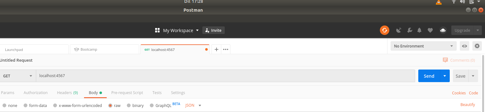
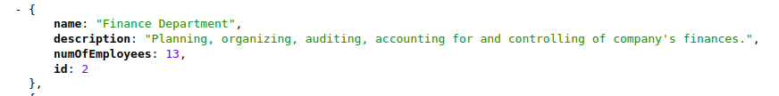
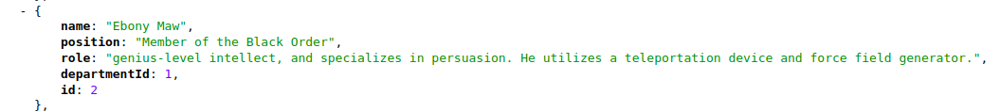
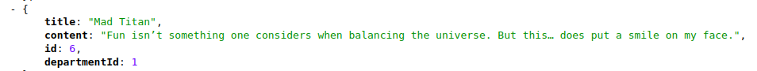

# Organisational API

A RESTful API that houses news/articles/posts that are available to all employees without navigating into any department, and others that are housed/classified within departments. Accessed by employees belonging to a certain department.

#### By Shadrack Adwera

## Description

POJOs are used to store department, news and employee(users) details which in turn are stored in a Postgres database through a DAO. An interface is used with the method signatues for the methods to create, read, update and delete which are in turn implemented in the dao classes. RESTful routing is used with the gson library being used to serialize and deserialize Java objets to JSON.

## Setup/Installation Requirements

* You need to install the [Java SDK](https://sdkman.io/install) in order to create Java applications and the [Java Runtime Environment](https://sdkman.io/usage) which provides the requirements for executing a Java application.
* The code can be run on any java IDE: NetBeans, IntelliJ IDEA, Eclipse etc
* Download and install [postman](https://www.getpostman.com/downloads/), then
* On IntelliJ, run the command **$ gradle run** and write the url **localhost:4567** on postman to test the end points

* A postgres database also needs to be [installed](https://www.2ndquadrant.com/en/blog/pginstaller-install-postgresql/)
* Once installed, fire up the database by typing on the terminal **$ psql** and you can now create a [user with a password](https://www.postgresql.org/docs/8.0/sql-createuser.html) . Make sure to edit the connection string in the **app.java** file with the credentails(user name and password) created in order to connect to your database.
* Recreate the tables and the database by running the command **psql < create.sql**
* Drop a database and its tables by running the command : **psql < drop.sql**

## Overview

* To view the API on your chrome browser, add the extension [JSON Viewer](https://chrome.google.com/webstore/detail/json-viewer/gbmdgpbipfallnflgajpaliibnhdgobh) to your browser and view the link: <https://adwera-organisational-api.herokuapp.com/>

## End Points

| URL                                   | HTTP Verb     | Description                                        |
|---                                    |---            |---                                                 |
| /department/new                       | POST          | Add a new department                               |
| /departments                          | GET           | Displays all departments                           |
| /departments/:id                      | GET           | Displays department Id                             |
| /department/:departmentId/user/new    | POST          | Add an employee to a department                    |
| /user/:id                             | GET           | Display a employees based on their Id              |
| /users                                | GET           | Display All employees                              |
| /department/:id/users                 | GET           | Displays all employees in a department             |
| /news/new                             | POST          | Add news                                           |
| /                                     | GET           | View All News                                      |
| /news/:id                             | GET           | View news by Id                                    |
| /department/:departmentId/news/new    | POST          | Add news to a department based on the department Id|
| /department/:id/news                  | GET           | View news belonging to a department                |

## Additional information

* To create a department in postman, route: **/department/new** use the format: **name, description, numOfEmployees**

* To create a new employee, route: **/department/:departmentId/user/new** use the format: **name, position, role, departmentId**

* To create a news item, route: /department/:departmentId/news/new use the format: **title, content, departmentId**

## Known Bugs

* Incase any bug is found, or a request for a new functionality is needed, kindly open an issue [here](https://github.com/ShadrackAdwera/Organisational-API/issues/new)

## Technologies Used

* IntelliJ IDEA
* PostgreSQL

## Support and contact details

Feel free to contribute to the project by:

* Forking the repo
* Create a new branch (git branch my-contribution)
* Move to your branch (git checkout my-contribution)
* Make the changes in the files
* Add changes to reflect the changes made
* Commit your changes (git commit -m "Added features")
* Push to the branch (git push origin my-contriution)
* Create a Pull Request

Incase of any feedback/comments feel free to contact me at adweshshaddie@gmail.com

### License

#### Copyright (c) 2019 Shadrack Adwera

#### Licenced under the [MIT License](LICENSE)
